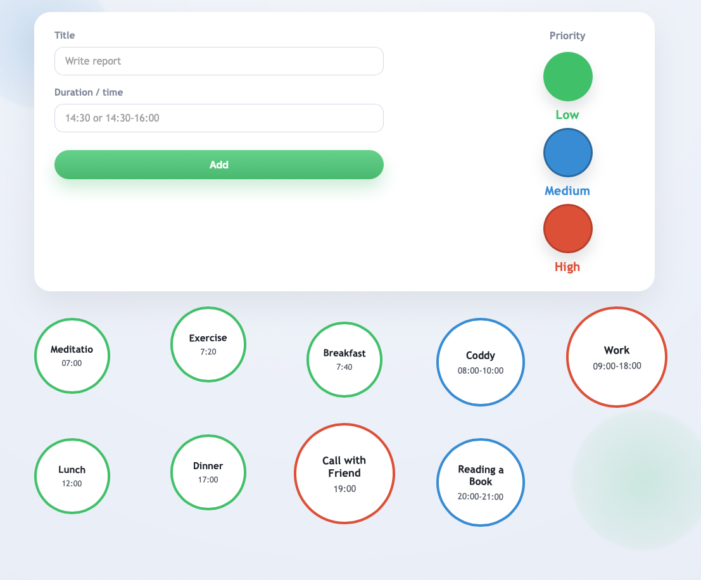

# Circle TODOs (Flask)

A small, clean Flask TODO app with **circular task badges**, **three priority levels**, and **JSON persistence**.

---

## 🖥️ Preview



The main view shows tasks as circular items ordered by time and priority.

---

## ✏️ Edit & Interaction


Tasks can be marked as done, assigned priority (Low / Medium / High), and managed dynamically.

---

## 🚀 Run locally

```bash
pip install -r requirements.txt
flask --app app run --debug
